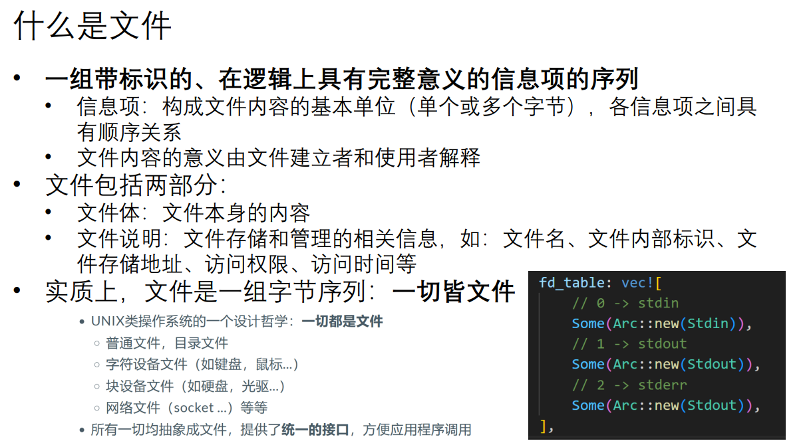
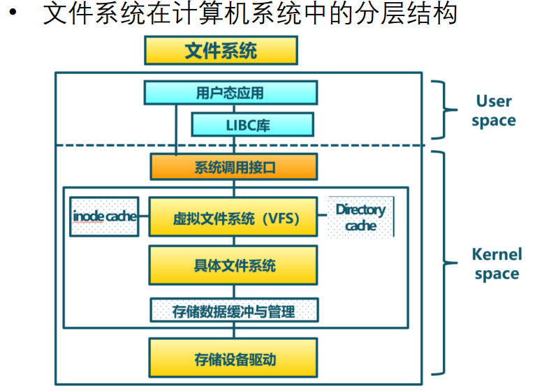

### 2025 04.13 准备第二阶段实验环境

- 准备第二阶段作业环境

  - 课程页面点击链接领取作业，创建仓库:https://github.com/LearningOS/2025s-rcore-heirish

  - clone到本地并配置docker环境

    ```
    ##参考:1.作业仓库README, 2.https://learningos.cn/rCore-Tutorial-Guide-2025S/0setup-devel-env.html
    git@github.com:LearningOS/2025s-rcore-heirish.git
    cd 2025s-rcore-heirish
    su root
    make docker
    ```

- 准备博客

  ```
  #fork from https://github.com/rcore-os/blog 
  git@github.com:heirish/blog.git
  cd blog
  sudo npm install hexo-cli -g 
  sudo npm install hexo --save
  hexo n 2025春夏操作系统训练营第一阶段总结-heirish
  ```
  - 注意：虚拟机中不能存放到与host windows共享的目录下，要放到虚似机系统本身的目录。因为与host windows共享的目录是不能创建软链接的， 否则安装hexo时会报错

### 2025.04.15
- 学习第一节课录频
  - 应用程序执行环境:

  
  - toolchain tree tuple: CPU-OS-runtimelib
- 实验
  ```
  cd 2025s-rcore-heirish
  su root
  make docker
  cd os
  make run
  ```
  - 遇到的问题:发现make run执行完成之后并没有预期的rustsbi和Hello World的输出。没有任何输出，像是卡在某在地方，ctrl+c也退出不了。最后只能用docker exec -it的方式进入运行的docker, 强制kill进程。
   解决思路如下:
    - 检查了仓库里的代码与课程和tutorial里的一样，并没有需要修改的地方。并且没有rustsbi的输出，怀疑是rustsbi的问题或是docker环境的问题。
    - 对比两个仓库的rustsbi
       ```
        heirish@heirish-VirtualBox:/mnt/vmshare/OS/qinghua$ md5sum rCore-Tutorial-v3/bootloader/rustsbi-qemu.bin
        eae6f6ba9c894fb2aec444162f1efe18  rCore-Tutorial-v3/bootloader/rustsbi-qemu.bin
        heirish@heirish-VirtualBox:/mnt/vmshare/OS/qinghua$ md5sum 2025s-rcore-heirish/bootloader/rustsbi-qemu.bin
        526a492a1592503f4c959f24a52630cc  2025s-rcore-heirish/bootloader/rustsbi-qemu.bin
       ```
     - 查看了作业仓库2025s-rcore-heirish与导学阶段时的rcore仓库rCore-Tutorial-v3里的Dockerfile,发现也不一样。
     - 最后重新进入作业仓库，再重新builder docker,解决问题
### 2025.04.17 ~ 2025.04.20 ch2
- 学习第二节课录频及rcore-tutorial-guide-2025s第二章(录频音画不同步基本听不太懂，主要自己看slides和tutorial)
  - 批处理系统 (Batch System):出现于计算资源匮乏的年代，其核心思想是： 将多个程序打包到一起输入计算机；当一个程序运行结束后，计算机会 自动 执行下一个程序。
  - 应用程序难免会出错，如果一个程序的错误导致整个操作系统都无法运行，那就太糟糕了。 保护 操作系统不受出错程序破坏的机制被称为 特权级 (Privilege) 机制， 它实现了用户态和内核态的隔离。
  - 代码仓库
    - make run执行过程: os/Makefile -> to user , user/Makefile -> python3 user/build.py -> objcopy -> back to os, cargo run build.rs -> cargo run build -> objcopy -> start quemu to run os.bin
    - user/src目录下是user_lib的代码，user/src/bin目录下是所有ch的测试bin代码。本章ch2总共有7个(4个异常退出的，3个正常退出的), 都需要链接user_lib库，但是在编译流程中未看到有编译这个库?(cargo rustc --bin会触发)
      ```
      使用 cargo rustc --bin 时：
        - Cargo 会先处理整个依赖图（包括 user_lib）
        - 然后专门编译指定的 binary
        - 等同于 cargo build --bin 但允许传递额外 rustc 参数
        - user_lib的编译并未生成最终目标库，而是作为app的依赖进行编译生成中间库，存放在target/riscv64gc-unknown-none-elf/release/deps目录下。可以通过在cargo rustc编译中添加-v查看编译详细信息。
      ```
    - 第二章的批处理系统主要代码实现都在os/batch.rs和os/trap中。 
    - 所有测试app执行流程如下:要么是通过trap_handler运行下一个app, 要么是通过sys_exit系统调用运行下一个app. 
- Notes:
  - 编译相关
    - build.rs 是一个 Rust 程序，会在正式编译你的 crate 之前被编译和运行。主要用于需要在编译时生成代码、检测系统环境、链接外部库等场景。
    - cmake参数-Clink-args=-Ttext=0x80400000, 告诉链接器将代码段(text section)的加载地址设置为指定值, 这里为0x80400000。编译完成后通过readelf -a <bin>就可以看到Entry point address为0x80400000.
    - GNU汇编指令
      ```
      # 定义一个或多个 64 位（8 字节）的数值
      .quad <expression> [,expression]... # 每个expression会被计算并存储为一个64bit的值。

      # 在汇编过程中直接包含二进制文件的内容到目标文件中
      .incbin <file-name>[,<offset>[,<length>]]
      ```
    - 让cargo build打印详细信息:`cargo build -v`
      - 完整的编译器调用命令
      - 每个编译步骤的详细参数
      - 依赖项的编译过程
    - RISCV 特权级切换
      
      当 CPU 执行完一条指令并准备从用户特权级 陷入（ Trap ）到 S 特权级的时候，硬件会自动完成如下这些事情：
      - sstatus 的 SPP 字段会被修改为 CPU 当前的特权级（U/S）。
      - sepc 会被修改为 Trap 处理完成后默认会执行的下一条指令的地址。
      - scause/stval 分别会被修改成这次 Trap 的原因以及相关的附加信息。
      - CPU 会跳转到 stvec 所设置的 Trap 处理入口地址，并将当前特权级设置为 S ，然后从Trap 处理入口地址处开始执行。

      而当 CPU 完成 Trap 处理准备返回的时候，需要通过一条 S 特权级的特权指令 sret 来完成，这一条指令具体完成以下功能：
      - CPU 会将当前的特权级按照 sstatus 的 SPP 字段设置为 U 或者 S ；
      - CPU 会跳转到 sepc 寄存器指向的那条指令，然后继续执行。
- 问题
  - 由于是在docker中跑的实验， 并且项目的Cargo.toml中有指定target, 在host pc上打开项目后rust-analyzer报错。只能在虚拟机中按实验仓库的脚本配置rust环境, 然后vscode通过remote ssh连接到虚拟机(好像可以直接vscode连接到virtualbox中的docker?后面再研究)
  - 编译时报错" linking with `rust-lld` failed: exit status: 1", 并且git branch时会报错"fatal:detected dubious ownership in reprository...", 按提示执行`git config --global --add safe.directory <dir>`, 然后再重新编译即可
### 2025.04.20 ch3
- 学习第二节课录频及rcore-tutorial-guide-2025s第二章(录频音画不同步基本听不太懂，主要自己看slides和tutorial)
  - 代码仓库:
    - 相比于ch2, ch3的user/app的entry point address有变化(build.py)，由固定的0x80400000变成了0x80400000+0x2000*i(i为app index), 也就是说一个app最大size为0x20000
    - 相比于ch2一次加载一个app到内存，ch3在启动时一次性将所有app加载到内存(0x80400000+0x20000*i), 通过src/loader.rs实现
    - 与ch2相比，ch3多了app之间的同级(User态)切换，在task模块中实现
    - 与ch2相比，ch3多了task调度系统，在timer.rs和trap_handler的Trap::Interrupt(Interrupt::SupervisorTimer) 分支实现 
- Notes
  - 分时多任务系统，它能并发地执行多个用户程序，并调度这些程序。为此需要实现
    - 一次性加载所有用户程序，减少任务切换开销；
    - 支持任务切换机制，保存切换前后程序上下文；
    - 支持程序主动放弃处理器，实现 yield 系统调用；
    - 以时间片轮转算法调度用户程序，实现资源的时分复用。
- 遇到的問題
  - 每次新進docker后執行cargo命令時都會同步"info: syncing channel updates for", 并且下載時很慢。進docker之后執行下面兩句設置環境變量. ~~TODO:在啟動docker時自動設置？~~, 己将这两个环境变量添加到[Dockerfile](./Dockerfile)中
    ```
    export RUSTUP_DIST_SERVER=https://mirrors.ustc.edu.cn/rust-static
    export RUSTUP_UPDATE_ROOT=https://mirrors.ustc.edu.cn/rust-static/rustup
    ```
  - 代碼修改后，`make run BASE=0`和`make run BASE=1`都能通過。但是執行`make run BASE=2`通不過，在get_time時返回的值始終為0. 并且在ch3_trace.rs中的第一個測試count_syscall(SYSCALL_GETTIMEOFDAY)返回的值很大。
    - 剛開始懷穎是實現的sys_trace系統調用有問題，檢查幾遍后也沒找到異常
    - 休息一會后，想了下出問題的現象，可能是棧出問題了。回想在os/entry.asm中有設置內核棧大小。而我實現的task_syscalls會導致struct TaskManager增大64k(MAX_APP_NUM * MAX_SYSCALL_ID * sizeof(usize) = 16 * 512 * 8byte = 16 * 4k). 看了下原來的棧大小設置成了64k, 也就是只是我添加的這部分就把目前的棧空間占完了。增加kernel stack大小后test通過。修改如下
    ```
    boot_stack_lower_bound:
        # .space 4096 * 16 
        .space 4096 * 32 # after added task_syscalls to tasksControlBlock, TaskManager will increase MAX_APP_NUM * MAX_SYSCALL_ID * sizeof(usize) = 16 * 512 * 8byte = 16 * 4k = 64k
        .globl boot_stack_top
    boot_stack_top:
    ```  
    - 沒有按目前只有的5個syscall去設計task_syscalls大小，而是按更大的值512(>最大的syscall_id:410)設計數組長度, 只是為了簡化代碼。
### 2025.04.22 ch4
学习教学录频以及rcore-tutorial对应章节
- satp寄存器
  - 默认情况下 MMU 未被使能，此时无论 CPU 处于哪个特权级，访存的地址都将直接被视作物理地址。
  - 可以通过修改 S 特权级的 satp CSR 来启用分页模式，此后 S 和 U 特权级的访存地址会被视为虚拟地址，经过 MMU 的地址转换获得对应物理地址，再通过它来访问物理内存。
  - RV64 架构下 satp 的字段分布
    
    - mode为0时，所有访问都被视为物理地址
    - mode为8时，启用sv39分页机制,所有 S/U 特权级的访存被视为一个 39 位的虚拟地址，MMU 会将其转换成 56 位的物理地址；如果转换失败，则会触发异常。
- SV39分页机制
  - 虚拟地址与物理地址格式与组成
    
    - 采用分页管理，单个页面的大小设置为4kB,每个虚拟页面和物理页帧都按 4 KB 对齐。4KB需要用 12 位字节地址来表示，因此虚拟地址和物理地址都被分成两部分： 它们的低 12 位被称为 页内偏移 (Page Offset) 
    - 虚拟地址的高 27 位，即[38:12]为它的虚拟页号 VPN； 物理地址的高 44 位，即[55:12]为它的物理页号 PPN。页号可以用来定位一个虚拟/物理地址属于哪一个虚拟页面/物理页帧
    - 地址转换是以页为单位进行的，转换前后地址页内偏移部分不变。MMU 只是从虚拟地址中取出 27 位虚拟页号， 在页表中查到其对应的物理页号，如果找到，就将得到的 44 位的物理页号与 12 位页内偏移拼接到一起，形成 56 位物理地址。
  - 页表
    
    - 每个应用都有一个表示地址映射关系的 页表 (Page Table) ，里面记录了该应用地址空间中的每个虚拟页面映射到物理内存中的哪个物理页帧
    - 我们可以用页号来代表二者，因此如果将页表看成一个键值对，其键的类型为虚拟页号，值的类型则为物理页号。
    - 当 MMU 进行地址转换的时候，虚拟地址会分为两部分（虚拟页号，页内偏移），MMU首先找到虚拟地址所在虚拟页面的页号，然后查当前应用的页表，根据虚拟页号找到物理页号；最后按照虚拟地址的页内偏移，给物理页号对应的物理页帧的起始地址加上一个偏移量，这就得到了实际访问的物理地址。
    - 在页表中，还针对虚拟页号设置了一组保护位，它限制了应用对转换得到的物理地址对应的内存的使用方式。最典型的如 rwx 
  - 页表项

    从页表中的pagetable图可以看到，pagetable中的每条记录(entry)需要记录物理地址页号以及其它信息，SV39分页模式下实际的页表项如下
     
    - 大小为8字节
    - [53:10]这44位是物理页号，PPN
    - [7:0]为标志位
      - 仅当 V(Valid) 位为 1 时，页表项才是合法的；
      - R/W/X 分别控制索引到这个页表项的对应虚拟页面是否允许读/写/取指；
      - U 控制索引到这个页表项的对应虚拟页面是否在 CPU 处于 U 特权级的情况下是否被允许访问；
      - G 我们不理会；
      - A(Accessed) 记录自从页表项上的这一位被清零之后，页表项的对应虚拟页面是否被访问过；
      - D(Dirty) 则记录自从页表项上的这一位被清零之后，页表项的对应虚拟页表是否被修改过。
  - 多级页表

    当一个应用的地址空间比较大的时候，页表中的项数会很多（事实上每个虚拟页面都应该对应页表中的一项，上图中我们已经省略掉了那些未被使用的虚拟页面），导致它的容量极速膨胀.已经不再是像之前那样数个寄存器便可存下来的了，CPU 内也没有足够的硬件资源能够将它存下来。因此它只能作为一种被内核管理的数据结构放在内存中，但是 CPU 也会直接访问它来查页表，这也就需要内核和硬件之间关于页表的内存布局达成一致。
    - 如果用线性表存储这个页表，则SV39分页模式下的页表大小为2^27*8字节=1GB的内存。2^27个虚拟页，每个页表项占8字节
    - SV39分页机制总的表达能力是2^39=512G的地址空间,己经很大了，但是实际应用用到的只是其中很小的一部分，通过类似字典树(Trie)算法实现分级页表能大大减小页表的内存占用。
    - 每个叶节点都需要保存 512(2^9)个8字节大小的页表项，一共正好4KB，可以直接放在一个物理页帧内。
    - 多级页表将总27位的VPN分成3部分，每一部分9位，因此每一部分可索引的大小为2^9=512个PTE,分别用于索引每个级别的(L0, L1, L2)的PTE
    - 多级页表的总内存消耗取决于节点的数目，每个节点需要存放在一个大小为4KB的物理页帧中。 
    - 每个三级页表管理地址空间中的大小为2M=4KB*512(2^9=512个VPN， 4KB是一个page的大小)的区域。
    - 每个二级页表管理地址空间中一块大小为1GB=4k\*512\*512的区域。
    - 考虑一个地址空间，除了根节点（即一级页表）占用的一个物理页帧之外，在映射地址空间中的一个实际用到的大小为T字节的连续区间的时候，最多需要额外分配T/1GB个二级页表节点和T/2MB个三级页表节点。
    - SV39多级页表的地址转换过程,SV39三级页表结构的地址转换类似于一个三维数组

       
  - 管理SV39多级页表
### 2025.04.22 ch4
学习教学录频以及rcore-tutorial对应章节
- rCore的双页表地址空间（两个多级页表地址空间，分别用于表示内核地址空间和用户地址空间）
  
  
- 问题:虚拟机挂了，重新配环境:-(
### 2025.04.26 ch5
- 根据tutorial自学ch5并完成實驗提交
- Notes
    - 按键 Ctrl+A 再输入 X 来退出qemu模拟器
### 2025.04.27-2015.04.28 ch6
- 学习教学录频以及rcore-tutorial对应章节
- notes
  - 什么是文件系统?
    
    
  - 什么是文件?
    
  - 文件系统需求
    
    - 文件系统实现需解决以下两个问题
      - 问题一: 如何来描述一个文件，如何来记录文件的各种管理信息？
        - 文件控制块:基本信息，访问控制信息，使用信息
        - 文件描述符
          
      - 如何来存放文件，即如何为文件中各个连续的逻辑块分配磁盘中的空闲物理块？如何来记录逻辑块与物理块之间的映射关系？
  - 文件描述符
    
  - opened file list
    
  - 文件系统设计与实现
    - 为解决问题一
      

      

      

      
    - 为解决问题二
      
      - superblock
      - 文件控制块inode:代码中存目录文件列表(DirEntry)的DiskInode
      - bitmap
      - 数据块: 代码中存文  件数据的DiskInode
      - 目录项(DirEntry)
      - 文件物理结构对比
        - 连续文件
          - 优点是不需要额外的空间开销，只要在文件目录中指出文件的大小和首块的块号即可，顺序和随机访问效率都很高
          - 缺点是动态地增长和缩小系统开销很大；文件创建时要求用户提供文件的大小；存储空间浪费较大
        - 串联文件
          - 克服了连续文件的不足之处，但文件随机访问的系统开销较大
          - 适合于顺序访问
        - 索引文件
          - 既适合于顺序存访问，也适合于随机访问
          - 是一种比较好的文件物理结构
          - 但索引表需额外空间与时间开销
          - UNIX系统是使用索引结构的典型例子
  - 文件访问过程示例:读写/tmp/hello
    
  - 文件系统分区
    
  - symbolic link vs. hard link
    
- 完成练习， 2025.04.28
  - ch6课件和讲解很优秀，课件很多图对理解文件系统非常有帮助
  - 画uml图对理解代码和整个框架很有用
  - 在vfs中的死锁问题耽误了些时间
  - 目前mmap, munmap实现比较丑陋，看有时间来得及的话能不能改一下
### 2025.4.29
- 学习ch7 tutorial
- 学习ch8 tutorial, 画process, thread, sync相关的UML图
### 2025.04.30 ~ 2025.05.01
- 完成ch8作业。中间花了比较长时间理解银行家算法， 学习了去年秋季的的教学视频和文档，最后理解了完成作业。
- 银行家算法，B站的这个也讲得不错: https://www.bilibili.com/video/BV19h411J7ef/?spm_id_from=333.337.search-card.all.click&vd_source=601dbc960255506eb5f6390166996d67