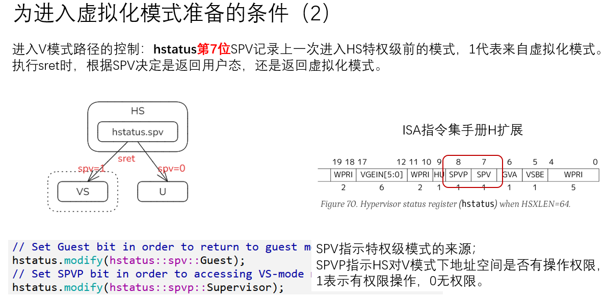

### 2025.05.06 unikernel基础与框架 
- 学习unikernel基础与框架录频
- 准备docker环境:
  ```
  git clone git@github.com:LearningOS/2025s-arceos-heirish.git
  cd 2025s-arceos-heirish
  cp ../2025s-rcore-heirish/Makefile ./
  将docker image改名为arceos-exercise
  运行make build_docker生成docker image
  ```
  - Makefile内容如下
  ```
    DOCKER_NAME ?= arceos-exercise
    .PHONY: docker build_docker
    
    docker:
            docker run --rm -it -v ${PWD}:/mnt -w /mnt ${DOCKER_NAME} bash
    
    build_docker: 
            docker build -t ${DOCKER_NAME} .
    
    #fmt:
    #       cd easy-fs; cargo fmt; cd ../easy-fs-fuse cargo fmt; cd ../os ; cargo fmt; cd ../user; cargo fmt; cd ..
  ```
- Notes
  - 主流内核模式
    
  - unikernel实验路线
    
  - 实验一框架组件构成与协作流程:
    
  - 小结
    
- exercise 1: 通过在axhal/src/lib.rs的write_bytes里hardcoding，让终端打印字符变成绿色(在输出字会前后加ANSI转义格式)
  ```
  pub fn write_bytes(bytes: &[u8]) {
        let prefix_bytes = "\u{1B}[32m".as_bytes();
        let suffix_bytes = "\u{1B}[m".as_bytes();
        for c in prefix_bytes {
            putchar(*c);
        }
        for c in bytes {
            putchar(*c);
        }
        for c in suffix_bytes {
            putchar(*c);
        }
    }
  ```
  - 这个会导致github ci测试通不过，因为测试shell是通过`tail -n1 output.txt | grep keyword`来判断的，如果按上述的在write_bytes里加前后缀，换行符在输出实际bytes内容时就写了，这样后面的suffix就会跳到下一行，因此实际最后测试找的keyword在倒数第二行，如果在write_bytes里写，需要处理最后一个字节是"\n"的情况，后面改成在axstd的macro.rs中实现
  ```
  #[macro_export]
  macro_rules! print {
      ($($arg:tt)*) => {
          $crate::io::__print_impl(format_args("\u{1B}[32m{}\u{1B}[m", format_args!($($arg)*)));
      }
  }
  
  /// Prints to the standard output, with a newline.
  #[macro_export]
  macro_rules! println {
      () => {
          $crate::io::__print_impl("\n");
      };
      ($($arg:tt)*) => {
          $crate::io::__print_impl(format_args!("\u{1B}[32m{}\u{1B}[m\n", format_args!($($arg)*)));
      }
  }
  ```
### 2025.05.07 unikernel基础与框架
- 完成exercise 2
  - 主要参考std中的map实现，也使用了hashbrown库
  - vec是在alloc crate里提供了，而hashmap需要自己实现.
  - 为了不改动exercise中的代码，hashmap在axstd::collections里，在axstd/src/lib.rs中将alloc的collections进行了改名，然后声明另一个collections将alloc::collections和axstd::axcollections包含进去
    ```
    pub use alloc::{boxed, collections as alloc_collections, format, string, vec};
    mod axcollections;
    pub mod collections {
      pub use super::alloc_collections::*;
      pub use super::axcollections::HashMap;
    }
    ```
  - globalallocator struct己定义，要使vec,string等可用，globalallocator必须实现trait GlobalAlloc并使用`#[cfg_attr(all(target_os = "none", not(test)), global_allocator)]`定义collections默认使用的global_allocator,refer:https://docs.rust-embedded.org/book/collections/
### 2025.05.08 - 2025.05.09 unikernel基础与框架 内存映射
#### 理解这一章的关键
- 哪些是硬件MMU支持的，哪些是需要软件层面提供的

| 操作 | 硬件（MMU）职责 | 软件（OS）职责 |
| -- | -- | --|
|申请内存|地址转换、TLB缓存、触发缺页异常 |	分配物理页、设置页表、处理异常、刷新TLB
|释放内存|	检测无效PTE并触发异常|清除PTE、回收物理内存、刷新TLB
- SV39中的大页(Super Page):
```
RISC-V 64处理器在地址转换过程中，只要表项中的 V 为 1 且 R/W/X 不全为 0 就会直接从当前的页表项中取出物理页号，再接上页内偏移，就完成最终的地址转换。注意这个过程可以发生在多级页表的任意一级。
- 在 SV39 中，如果使用了一级页索引就停下来，则它可以涵盖虚拟页号的高9位为某一固定值的所有虚拟地址，对应于一个1G的大页；
- 如果使用了二级页索引就停下来，则它可以涵盖虚拟页号的高18位为某一固定值的所有虚拟地址，对应于一个2M的大页。
- 以同样的视角，如果使用了所有三级页索引才停下来，它可以涵盖虚拟页号的高27位为某一个固定值的所有虚拟地址，自然也就对应于一个大小为4kB的虚拟页面 
```
- 物理内存的可用范围是_ekernel到指定的最大物理地址的左闭右开的区间[_ekernel, phyaddr_end)
- 因为是unikernel, 所以是一次性将所有可用物理内存地址范围axhal::mem::default_free_regions全部一次性通过axruntime::AddrSpace::map_linear直接映射成虚地址范围并写入PTE的, 后续GlobalAllocator就直接操作映射后的虚地址范围，初始的flags: MemRegionFlags::FREE | MemRegionFlags::READ | MemRegionFlags::WRITE, 映射时会将MemRegionFlags::FREE忽略, 然后加上PTE::V,在crate page_table_entry中处理的


- 第一阶段:直接写了两个一级PTE，形成两个1G的大页
    - arceos/modules/axhal/src/platform/riscv64_qemu_virt/boot.rs 
    - 映射到的物理地址为0x8000_0000~0xC000_0000, 物理页page size为4K(2^12), 因此这个物理地址对应PPN为0x80000 ~ 0xC0000
    - 所有的常量定义都在arceos/platforms/riscv64-qemu-virt.toml中，但是怎么最终在编译时用到的?
      > 在arceos/modules/axconfig/build.rs中读取上面这个toml文件，并生成config.rs的，生成的文件在target/riscv64gc-unknown-none-elf/release/build/axconfig-ae9a66e9535d7184/out/config.rs
    - boot时，只有一级页表BOOT_PT_SV39, 512个PTE， 每个PTE直接映射到1G的物理block
      ```
      #[link_section = ".data.boot_page_table"]
      static mut BOOT_PT_SV39: [u64; 512] = [0; 512];
      
      unsafe fn init_boot_page_table() {
          // 0x8000_0000..0xc000_0000, VRWX_GAD, 1G block
          BOOT_PT_SV39[2] = (0x80000 << 10) | 0xef;
          // 0xffff_ffc0_8000_0000..0xffff_ffc0_c000_0000, VRWX_GAD, 1G block
          BOOT_PT_SV39[0x102] = (0x80000 << 10) | 0xef;
      }
      
      unsafe fn init_mmu() {
          let page_table_root = BOOT_PT_SV39.as_ptr() as usize;
          satp::set(satp::Mode::Sv39, 0, page_table_root >> 12);
          riscv::asm::sfence_vma_all();
      }
      ```
    - pte_index = vaddr/1G后保留最后9位,即取30~38位, 2^9 = 512
    - pte_index for vaddr 0x8000_0000: 第30~38位结果为0x2 
    - pte_index for vaddr 0xffff_ffc0_8000_0000: 第30~38位为0x102(100_0000_10)
- 第二阶段:arceos/modules/axruntime/src/lib.rs -> arceos/modules/axmm/src/lib.rs
- 代码中物理地址与虚地址的转换是直接通过加减offset简单实现的
- 代码指令读写地址时还是通过MMU查找PT
- tour/u_3_0的cargo.toml中不加paging feature,会报错
  ```
  Try to access dev region [0xFFFFFFC022000000], got [  0.134963 0 axhal::arch::riscv::trap:24] No registered handler for trap PAGE_FAULT
  [  0.141599 0 axruntime::lang_items:5] panicked at modules/axhal/src/arch/riscv/trap.rs:25:9:
  Unhandled Supervisor Page Fault @ 0xffffffc080203f60, fault_vaddr=VA:0xffffffc022000000 (READ):
  TrapFrame {
  ```
  加了paging后正确的输出为
  ```
  ry to access dev region [0xFFFFFFC022000000], got 0x646C6670
  Got pflash magic: pfld
  ```
  是因为没开启第二阶段的paging时，不会对mmio段的物理内存作map_region,因此通过虚地址0xFFFFFFC022000000访问时会产生pagefault进入trap流程，在hal::arch::risv::trap.rs的riscv_trap_handler中处理
- 可以通过`make run LOG=trace A=tour/u_3_0`打开trace日志查看更多调试信息，里面包含有map_region的日志
- 先初始化globalallocator,再初始化memory-management(其中会去创建虚拟内存地址空间，做region_mapping),分配的第一个内存是一个page，用于PT的第一级
  ```
  axruntime::init_allocator -> axalloc::global_init
  axmm::init_memory-management -> axmm::new_kernel_space() -> axmm::AddrSpace::new_empty() -> page_table_multiarch::riscv::Sv39PageTable<PagingHandlerImpl>::try_new() -> page_table_multiarch::riscv::Sv39PageTable<PagingHandlerImpl>::alloc_table() -> PagingHandlerImpl::alloc_frame() -> global_alloctor().alloc_pages(1,PAGE_SIZE_4K)
  ```
- 完成exercise 3: bump allocator
  - 参考了现有的allocator中的写法,key points:1.四个位置指针，2. allocate时的alignment处理和overlap检查, 3.由于是连续的分配，目前不支持dealloc，足以通过ci了
### 2025.05.10 unikernel基础与框架 多任务并发


### 2025.05.10 unikernel基础与框架 任务调度框架
- 协作式(主动让出)调度与抢占式调度
- 协作式调度算法：FIFO
- 抢占式调度算法:rr,cfs
  

- arceos中的irq开启位置: APP:axstd["sched_cfs"] -> axstd:axfeat["sched_cfs"] -> axfeat中的sched_fs声明`sched_cfs = ["axtask/sched_cfs", "irq"]`,因此只要在APP中声明了feature shced_cfs,根据依赖关系，会在axfeat中开启irq feature
### 2025.05.10 unikernel基础与框架 块设备與文件系統 
- 在執行docker run時添加上`--privileged`選項，否則在`mount disk.img ./mnt`時會報錯"no such file or directory", 使tour/u_8_0的執行失敗。
### 2025.05.12 monolithic kernel - userpsace
- 完成examples/shell练习
- monolithic kernel
  
  
  
  
  - 虚拟内存空间结构体AddrSpace
    ```
        pub struct AddrSpace {
        va_range: VirtAddrRange,  //地址空间可见的可操作的地址范围,例如useraddrspace中这部分为低地址范围，kerneladdrspace中这部分为高地址范围
        areas: MemorySet<Backend>, //在va_range这个可见范围内，有多少个区域
        pt: PageTable, //页表引用
        }
    ```
    
  - U特权级到M特权级的切换通过ecall
  - 在内核态完成用户app的环境准备(uspace,memorting mappting, task create),然后在modules/axhal/src/arch/riscv/context.rs的enter_uspace中完成到用户态的切换。开始运行用户程序。
  - 用户程序中的syscall调用时会触发trap再到内核态，然后内核态调用注册的syscall handler进行处理
### 2025.05.13 monolithic kernel - userspace


- 在populating设置为false时，为on-demand方式做内存映射，即刚开始只做一个空映射(PADDR值为0)到PT,然后在MMUI做地址翻译时产生PAGEFault, 在PAGEFault的异常处理函数中实际去申请物理页并更新到对应虚拟地址的PTE.代码在modules/axmm/src/backend/alloc.rs的函数map_alloc中，当populate为false时，pt.map_region传入的get_paddr函数为`|_| 0.into()`, 通过这个get_paddr得到的物理地址始终为0.

### 2025.05.14 补ramfs_rename exercise
- 在workspace的根Cargo.toml中指定使用本地的axfs_ramfs而非远程crate.io中的
- 在本地axfs_ramfs的dir.rs中实现rename
- examples/shell中没有修改ramfs代码就能实现，是因为examples/shell中实际用的是fatfs.因为在modules/axfs中默认是开启除myfs之外的所有fs feature,因此在axfs的lib.rs init_filesystem -> root.rs init_rootfs中做文件系统初始化时实际是创建了fatfs,可以对比一下examples/shell与exercises/ramfs_rename的Cargo.toml
   ```
   ####examples/shell
   [features]
   use-ramfs = ["axstd/myfs", "dep:axfs_vfs", "dep:axfs_ramfs", "dep:crate_interface"]
   default = []

   ###exercises/ramfs_rename
   [features]
   default = ["axstd/myfs", "dep:axfs_vfs", "dep:axfs_ramfs", "dep:crate_interface"]
   ```
### 2025.05.15 hypervisor




### 2025.05.15 完成hypervisor exercise simple-hv
主要理解关键点'
- 指令引发异常后， 会调用_guest_exit, 是通过设置stvec设置trap处理入口地址为_guest_exit , _guest_exit执行完成后就返回到_run_guest的返回地址，执行一下条指令，即vmexit_handler.
- 如何切换回VM执行下一条指令:prepare context, invoke _run_guest, 要注意设置sepc的值来正确跳到下一条指令
  - 查看指令地址:`riscv64-linux-musl-objdump  -D arceos/target/riscv64gc-unknown-none-elf/release/skernel2`
- hypervisor的main中是一个while循环一直跑run_guest直到返回为true.
- 需要在前两次trap发生成设置下一次_run_guest的执行环境以及A0，A1的值
### 2025.05.19 学习第8节课hypervisor地址空间管理


- 完成课后练习:改为emulator-mode,在运行(make run)之前准备pflash_back.txt文件，内容为pfld, 代码中在NestedPageFault处理时映射pflash地址，并读pflash_back.txt内容写入映射的内存地址。
### 2025.05.20 学习第9节 时钟中断
- 抢占式调度算法依赖于时钟中断。


h_3_0练习hypervisor自身在启动时也enable了irq, multitask feature,并注册了timer irq handler.因此在guestOS调用SetTimer之前，所有的timer interrruptions都是由hypervisor自身的handler处理的。在guest OS调用SetTimer时，禁用guest时钟中断，开启hypervisor时钟中断。当定时器触发中断时，hypervisor会进入handler处理流程？同时guest会进入vm_exit触发vmexit_handler,禁用hypervisor时钟中断并将中断注入guest，触发guest的timer interrupt handler流程。